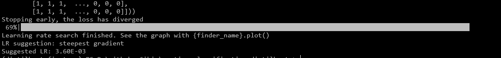
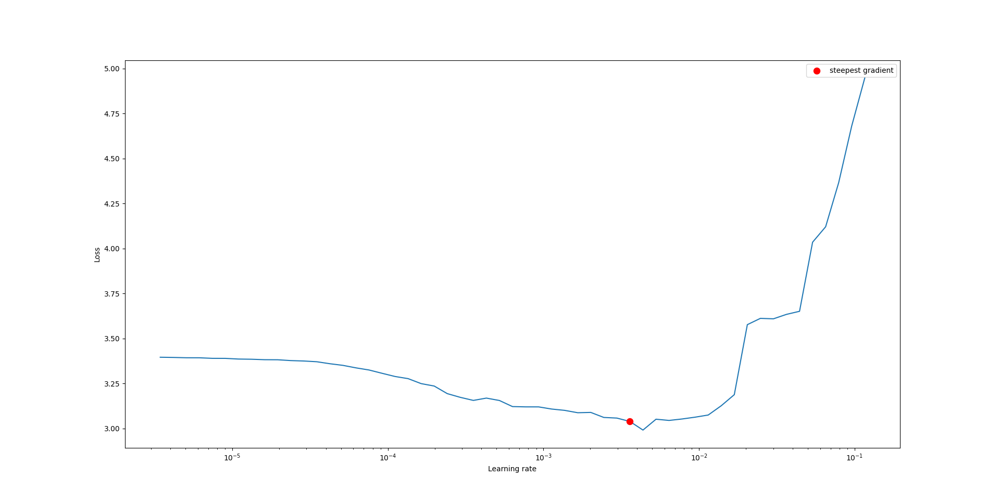
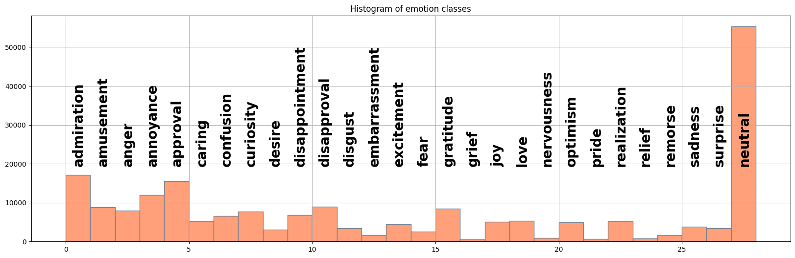

# emotion_classification_distilbert_


# 🎭 Emotion Classification with DistilBERT 🚀

[](https://www.pytorchlightning.ai/)
[](https://huggingface.co/docs/transformers/model_doc/distilbert)
[](https://github.com/google-research/google-research/tree/master/goemotions)

An end-to-end NLP pipeline that fine-tunes a **DistilBERT** model to categorize text into **28 distinct emotion classes** using the Google **GoEmotions** dataset.

---

## 🌟 Key Features

*   **⚡ Lightweight Power:** Uses DistilBERT for high performance with a smaller footprint and faster inference.
*   **🔡 Custom Tokenization:** Implements BPE (Byte-Pair Encoding) fine-tuning to generate project-specific `vocab.json` and `merges.txt`.
*   **🧪 Scalable Training:** Built on **PyTorch Lightning** for clean, reproducible, and hardware-agnostic training code.
*   **🎯 Multi-Class Precision:** Utilizes **Cross-Entropy Loss** to optimize classification across 28 nuanced emotional labels.

---

## 🛠️ Technical Workflow

### 1. Tokenizer Fine-tuning (BPE) ✍️
Standard tokenizers sometimes miss the nuances of emotional sub-text. In this project, we:
*   Fine-tuned a **Byte-Pair Encoding (BPE)** tokenizer on the GoEmotions corpus.
*   Exported custom `vocab.json` and `merges.txt` to handle unique vocabulary and emotional expressions effectively.

### 2. Model Architecture 🧠
We utilize **DistilBERT**, which retains roughly 97% of BERT's performance while being 40% smaller and 60% faster. This makes it ideal for deployment in real-time emotion detection systems.

### 3. 🚀 Speed-Dating with Hyperparameters: The LR Finder 🔍✨

Finding the perfect **Learning Rate** doesn't have to be a guessing game of endless trial and error! 🎯 We integrated the **LR Finder** module to navigate the complex loss landscape with surgical precision. 📈 By performing a "mock" training run and steadily ramping up the learning rate, we can visualize exactly where the gradient is steepest. 📉 This allows us to pinpoint that **"Golden Mean"**—the sweet spot where the model learns at lightning speed without spiraling into chaotic divergence. 💥 It’s essentially a **GPS for optimization**, ensuring our DistilBERT model hits the ground running with the most efficient step size possible! 💎🌈



### 4. Training Logic ⚡
The training is handled by a `LightningModule`, which organizes the code into:
*   **Training Step:** Calculation of **Cross-Entropy Loss**.
*   **Optimizer:** AdamW with a linear learning rate scheduler.
*   **Validation:** Monitoring accuracy and F1-score across all 28 classes.

---

## 📊 The 28 Emotions
The model classifies text into the following categories:
> *Admiration, Amusement, Anger, Annoyance, Approval, Caring, Confusion, Curiosity, Desire, Disappointment, Disapproval, Disgust, Gratitude, Grief, Joy, Love, Nervousness, Optimism, Pride, Realization, Relief, Remorse, Sadness, Surprise, and Neutral.*


---

## 🚀 Getting Started

### Prerequisites
```bash
pip install torch pytorch-lightning transformers datasets

---

## 📂 Project Structure
*   `data/`: Scripts to load and preprocess GoEmotions.
*   `tokenizer_config/`: Contains the generated `vocab.json` and `merges.txt`.
*   `model.py`: The DistilBERT architecture wrapped in PyTorch Lightning.
*   `trainer.py`: Main entry point for training and evaluation.

---

## 🤝 Contributing
Feel free to open issues or submit pull requests to improve the accuracy or efficiency of the model!

## 📜 License
This project is licensed under the MIT License.